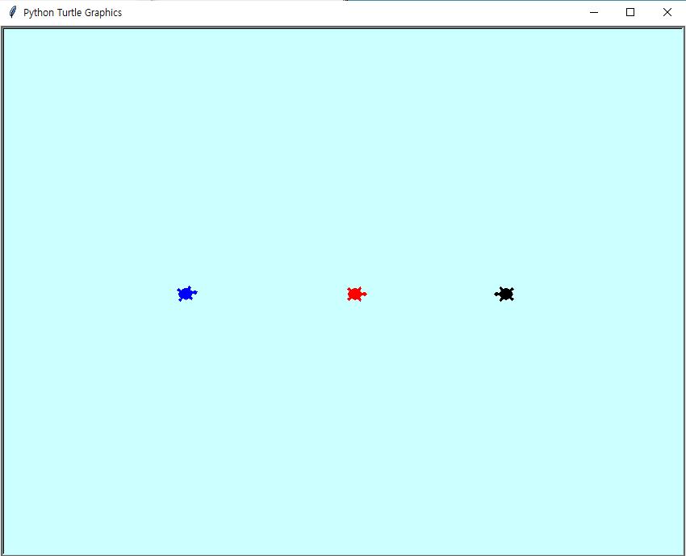

# Turtle Runaway
### 게임 설명
검은 거북이 : player

빨간 거북이, 파란 거북이 : ai

검은 거북이가 빨간 거북이를 피해 파란 거북이를 잡는다.

빨간 거북이와 접촉하면 점수를 잃고 파란 거북이와 접촉하면 점수를 얻게 된다.

빨간 거북이와 접촉: -1점/초

파란 거북이와 접촉: +1점/초

### 게임 방법
방향키를 이용하여 검은 거북이를 조종해 파란 거북이 근처로 움직여 점수를 얻는다.

### 화면 설명
오른쪽 위에는 게임시간과 점수가 나타난다.

